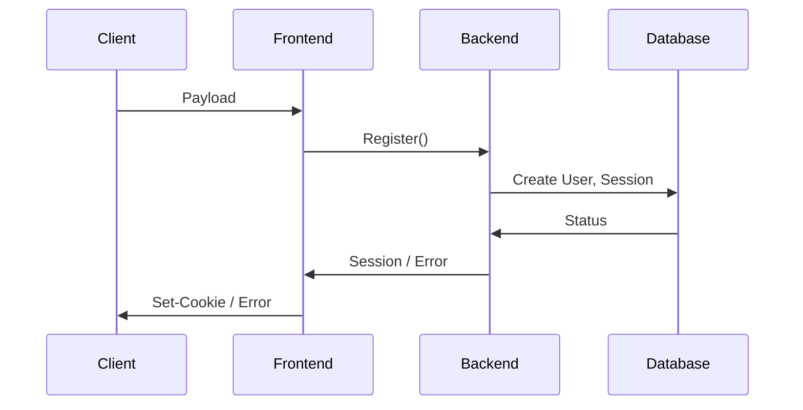
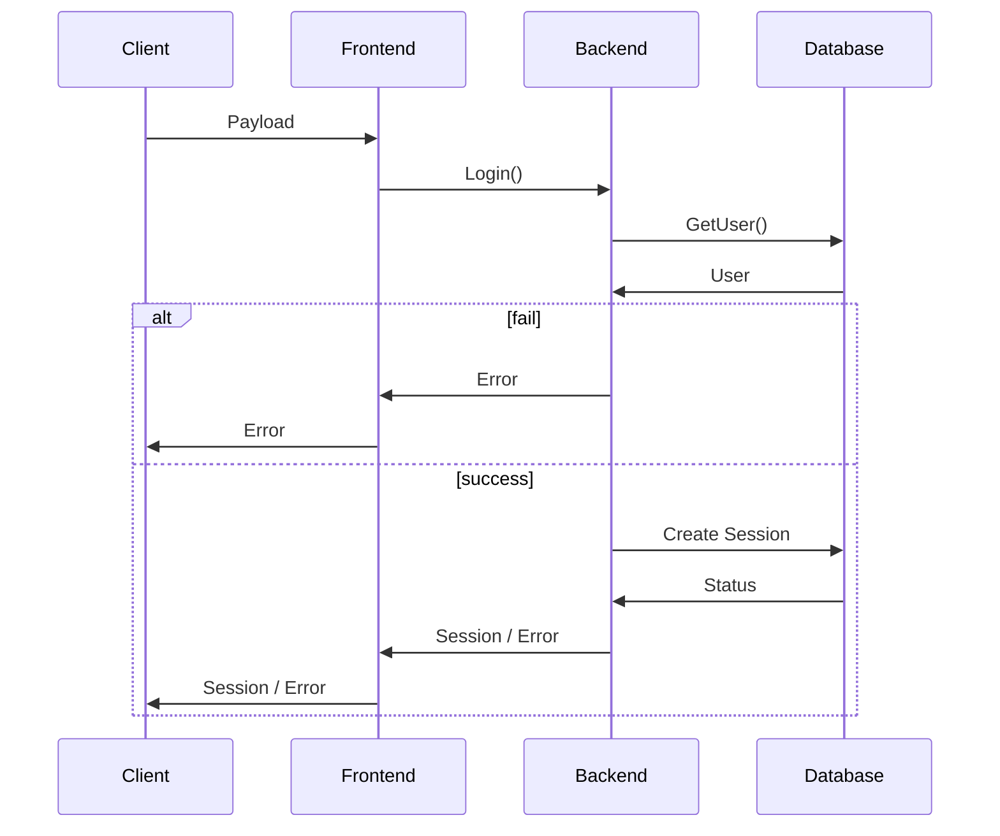
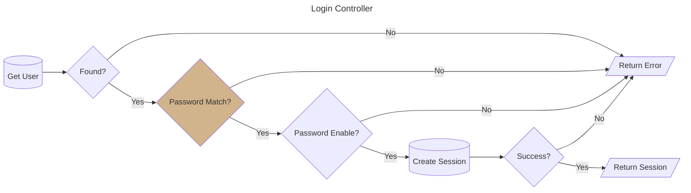

# Credential Service

## Register

```mermaid
sequenceDiagram
    participant Client
    participant Frontend
    participant Backend
   participant Database

    Client->>Frontend: Payload
    Frontend->>Backend: Register()
    Backend->>Database: Create User, Session
    Database->>Backend: Status
    Backend->>Frontend: Session / Error
    Frontend->>Client: Set-Cookie / Error
```

## Login

```mermaid
sequenceDiagram
    participant Client
    participant Frontend
    participant Backend
   participant Database

    Client->>Frontend: Payload
    Frontend->>Backend: Login()
    Backend->>Database: GetUser()
    Database->>Backend: User
    alt fail
     Backend->>Frontend: Error
      Frontend->>Client: Error
    else success
     Backend->>Database: Create Session
     Database->>Backend: Status
     Backend->>Frontend: Session / Error
     Frontend->>Client: Session / Error
   end
```

```mermaid
---
title: Login Controller
---
flowchart LR
  A[(Get User)] --> B{Found?}
  B -->|No| Z[/Return Error/]
  B -->|Yes| C{Password Match?}
  C -->|No| Z
  C -->|Yes| D{Password Enable?}
  D -->|No| Z
  D -->|Yes| E[(Create Session)]
  E -->F{Success?}
  F -->|No| Z
  F -->|Yes| Y[/Return Session/]
  
  style C fill:tan
```
