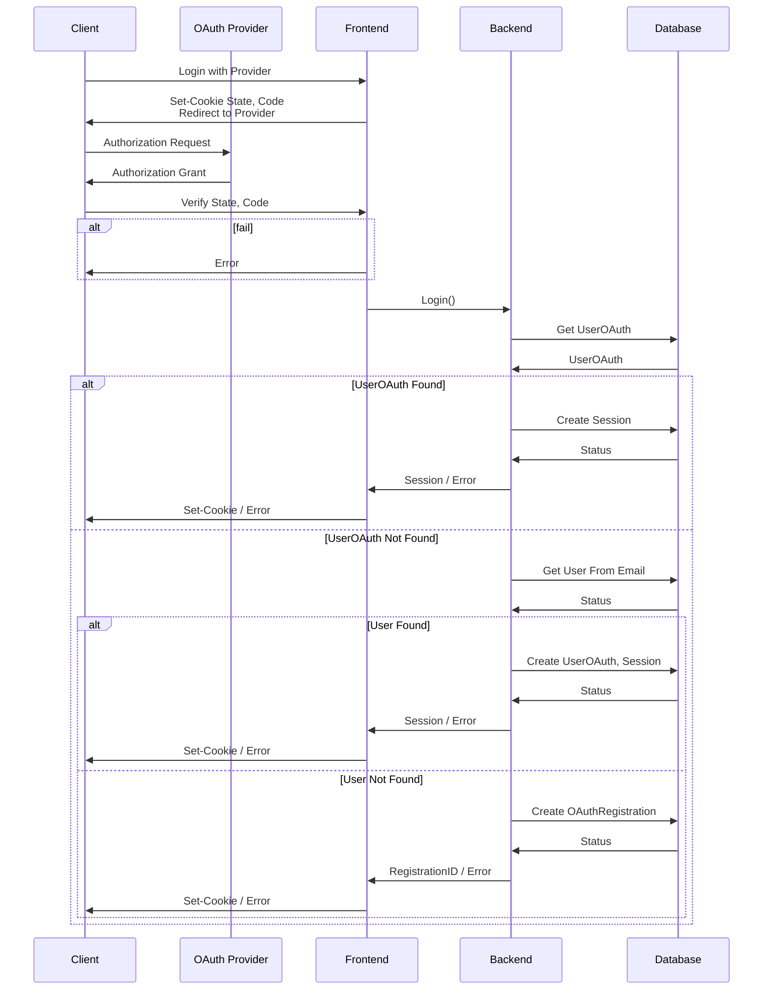
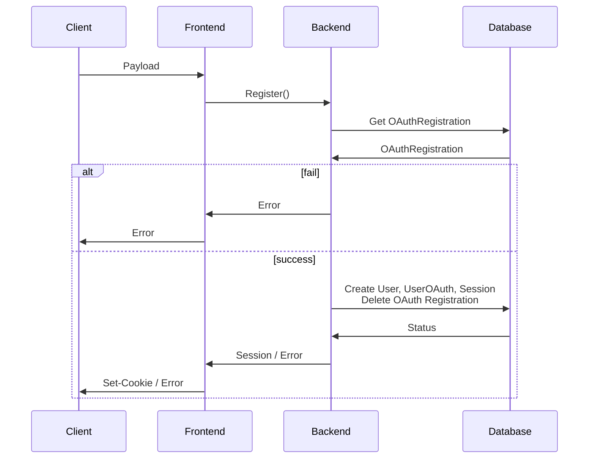

# OAuth Service

## Login

```mermaid
sequenceDiagram
  participant Client
  participant OAuth as OAuth Provider
  participant Frontend
  participant Backend
  participant Database

  Client->>Frontend: Login with Provider
  Frontend->>Client: Set-Cookie State, Code<br/>Redirect to Provider
  Client->>OAuth: Authorization Request
  OAuth->>Client: Authorization Grant
  Client->>Frontend: Verify State, Code
  alt fail
    Frontend->>Client: Error
  end
  
  Frontend->>Backend: Login()

  Backend->>Database: Get UserOAuth
  Database->>Backend: UserOAuth
  alt UserOAuth Found
    Backend->>Database: Create Session
    Database->>Backend: Status
    Backend->>Frontend: Session / Error
    Frontend->>Client: Set-Cookie / Error
  else UserOAuth Not Found
    Backend->>Database: Get User From Email
    Database->>Backend: Status
    alt User Found
      Backend->>Database: Create UserOAuth, Session
      Database->>Backend: Status
      Backend->>Frontend: Session / Error
      Frontend->>Client: Set-Cookie / Error
    else User Not Found
      Backend->>Database: Create OAuthRegistration
      Database->>Backend: Status
      Backend->>Frontend: RegistrationID / Error
      Frontend->>Client: Set-Cookie / Error
    end
  end
```

## Register

```mermaid
sequenceDiagram
  participant Client
  participant Frontend
  participant Backend
  participant Database

  Client->>Frontend: Payload
  Frontend->>Backend: Register()
  Backend->>Database: Get OAuthRegistration
  Database->>Backend: OAuthRegistration
  alt fail
    Backend->>Frontend: Error
    Frontend->>Client: Error
  else success
  Backend->>Database: Create User, UserOAuth, Session<br/>Delete OAuth Registration
  Database->>Backend: Status
    Backend->>Frontend: Session / Error
    Frontend->>Client: Set-Cookie / Error
  end
```
